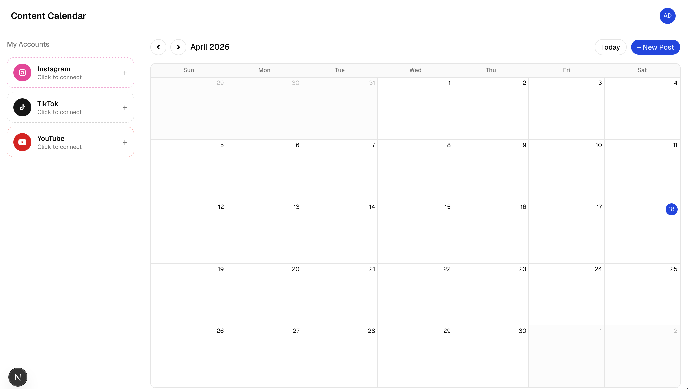

# Next.js Content Calendar

A social media content calendar example built with Next.js, shadcn/ui, and Supabase auth. Users connect their Instagram, TikTok, and YouTube accounts, then compose, schedule, and track posts across all connected platforms from a single calendar. Social posting and account management are handled by the [Post for Me](https://postforme.dev) API via the `post-for-me` npm SDK.



## Running this project

1. Install dependencies

   ```bash
   bun install
   # or: npm install
   # or: pnpm install
   # or: yarn install
   ```

2. Copy `.env.example` to `.env.local`:

   ```bash
   cp .env.example .env.local
   ```

3. Set up Supabase. Pick one of the following:

   **Option A — Local Supabase** (recommended for development)

   A `supabase/` config is already checked in, so you can spin up a local instance with the Supabase CLI:

   ```bash
   bunx supabase start
   # or: npx supabase start
   # or: pnpm dlx supabase start
   # or: yarn dlx supabase start
   ```

   This prints a local API URL and publishable key — paste them into `NEXT_PUBLIC_SUPABASE_URL` and `NEXT_PUBLIC_SUPABASE_PUBLISHABLE_KEY` in `.env.local`.

   **Option B — Hosted Supabase**

   Create a project at [supabase.com](https://supabase.com), then copy the project URL and publishable key from the project's API settings into `.env.local`.

4. Get a Post for Me API key from [postforme.dev](https://postforme.dev) and set it as `POST_FOR_ME_API_KEY` in `.env.local`.

5. Start the dev server

   ```bash
   bun run dev
   # or: npm run dev
   # or: pnpm dev
   # or: yarn dev
   ```

6. Open [http://localhost:3000](http://localhost:3000), sign up, and connect your social accounts to start scheduling posts.

## Building your own

You can use this example as a starting point for building your own content calendar with Claude Code (or any other AI coding agent).

The `prompt/` directory contains everything you need:

- `PROMPT.md` — the full specification describing the app's features, data flow, and Post for Me integration.
- `calendar-skeleton.png` — reference layout for the monthly calendar view.
- `post-composer-skeleton.png` — reference layout for the post composer dialog.

To build your own version:

1. Start a new Next.js project with shadcn/ui and Supabase auth configured.
2. Hand `prompt/PROMPT.md` along with both skeleton images to your AI agent as context.
3. Let the agent scaffold the calendar, composer, and Post for Me integration based on the prompt and reference screenshots.

The prompt is written to stand on its own — pair it with the screenshots and the agent has everything it needs to produce a working app with the same setup as this one.
